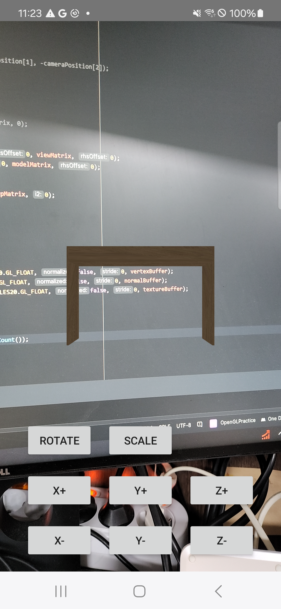

# Practice demo using OpenGL in Android

This is the repository that contains simple example of using OpenGL in Android. Followings are the contents that this example has.

- Loading blender object (.obj) 
  - Loading texture using image bitmap is possible
  - You can use your own object file instead of default object! Place it in *assets/* folder and change the object file name in ObjRenderer.java 
- Rendering the virtual object on the screen
  - Moving the object by tapping the screen
  - Moving the camera by moving the screen
- Simple controller of scaling, rotation and translation
- Camera preview

