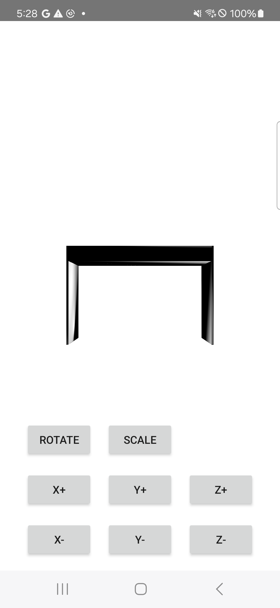

# Practice demo using OpenGL in Android

This is the repository that contains simple example of using OpenGL in Android. Followings are the contents that this example has.

- Loading blender object (.obj) 
- Rendering the virtual object on the screen
- Simple controller of scaling, rotation and translation
- Camera preview

